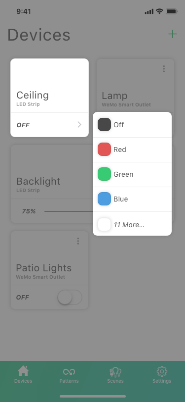
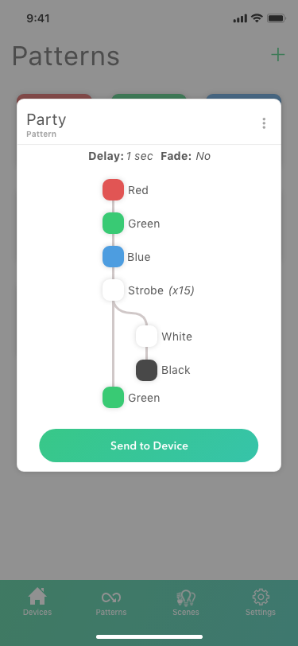

# Aurora App

A [Flutter](https://flutter.dev) app for controlling smart lights powered by [aurora-server](https://github.com/barrymcandrews/aurora-server).

### Screenshots
<link rel="stylesheet" type="text/css" media="all" href="docs/style.css" />

## Getting Started
For instructions on building this project follow the [Flutter Documentation](https://flutter.dev/docs).

## Mockups

Since I'm working on this project alone, I realize I may never finish this app. So I'd like to share my vision. Here are some of my mockups:

<kbd></kbd>&nbsp;&nbsp;&nbsp;&nbsp;<kbd></kbd>&nbsp;&nbsp;&nbsp;&nbsp;<kbd></kbd>

<kbd></kbd>&nbsp;&nbsp;&nbsp;&nbsp;<kbd></kbd>&nbsp;&nbsp;&nbsp;&nbsp;<kbd></kbd>

<kbd></kbd>

